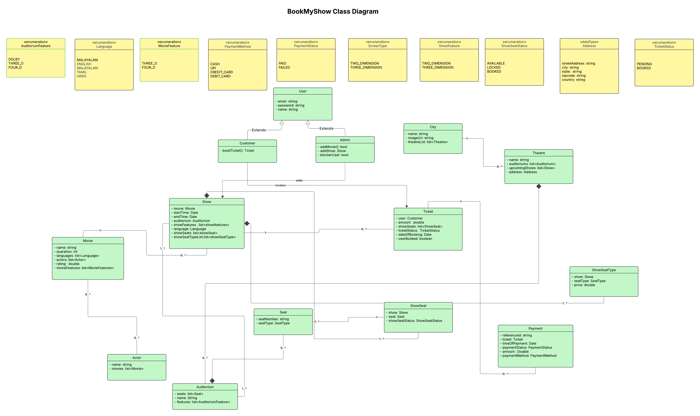

# 🎬 BookMyShow-like Movie Ticket Booking System

This project is a simplified backend implementation of a movie ticket booking system inspired by BookMyShow.  
The main goal of this project is to practice **Object-Oriented Design**, backend architecture, and **preventing double booking using database transactions**.

---

# 🚀 Tech Stack

- Java
- Spring Boot
- Hibernate / JPA
- MySQL
- Maven

---

# 🧠 Problem Statement

In real-world booking systems, one of the critical challenges is **preventing multiple users from booking the same seat at the same time**.

Example scenario:

1. User A tries to book **Seat A1**
2. User B also tries to book **Seat A1** at nearly the same time
3. Without proper handling, the system might allow **double booking**

This project demonstrates how **transaction management** can help maintain **data consistency and prevent duplicate seat reservations**.

---

# 🏗 System Design

The system models the following core entities:

- Movie
- Theatre
- Screen
- Show
- Seat
- Booking

Each entity is designed following **Object-Oriented Design principles** with clear responsibilities and relationships.

---

# 📊 Class Diagram

Below is the high-level class diagram of the system.



*(Place your diagram inside a folder called `docs` in your repository)*

---

# ⚙️ Booking Flow

1. User selects a **movie show**
2. User selects **available seats**
3. System checks whether the seats are already booked
4. Booking request runs inside a **database transaction**
5. If seats are available → booking is confirmed
6. If seats are already booked → booking is rejected

---

# 🔒 Preventing Double Booking

The booking operation is wrapped inside a **transaction** using Spring's transaction management.

Example:

```java
@Transactional(isolation = Isolation.SERIALIZABLE)
    public Ticket bookTicket(Long showId, List<Long> seatIds,Long userId){

      var showSeats= showseatRepository.findAllById(seatIds);
      for(ShowSeat showSeat: showSeats){
          if(!showSeat.getShowSeatStatus().equals(ShowSeatStatus.AVAILABLE) ){

              throw new ShowSeatNotAvailableException("ShowSeat ID: " +
                    showSeat.getId() + " not available.");
          }
      }
        for (ShowSeat showSeat: showSeats) {
            showSeat.setShowSeatStatus(ShowSeatStatus.LOCKED);
            showseatRepository.save(showSeat);
        }
        var show= showRepository.findById(showId).orElse(null);
        var user= userRepository.findById(userId).orElse(null);
        Ticket ticket = new Ticket();
        ticket.setShow(show);
        ticket.setShowSeats(showSeats);
        ticket.setUser(user);
        ticket.setTicketStatus(TicketStatus.PENDING);
        ticket.setDateOfBooking(new Date());
        var savedTicket= ticketRepository.save(ticket);
        return  savedTicket;

    }